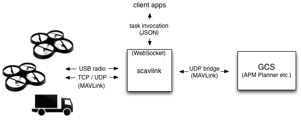

# Scavlink: an open source Scala library for orchestrating MAVLink-based autonomous vehicles

Scavlink is an open source Scala library with an embedded WebSocket server for controlling fleets of autonomous vehicles that speak the [MAVLink](http://qgroundcontrol.org/mavlink/start) protocol (e.g. [APM](http://ardupilot.com), [Pixhawk](https://pixhawk.ethz.ch)). It's based on [Akka](http://akka.io), with a fully asynchronous, event-based actor model for handling low-level packet conversations as well as orchestrating higher-level tasks across multiple vehicles.

It includes a set of async APIs for navigation, telemetry, missions, parameters and more, which can be invoked locally in a Scala application or remotely over a secure WebSocket channel. The API model is extensible, so you’re encouraged to get under the hood, implement your own, and submit a pull request.

The library is designed to handle multiple vehicles of all types - air, land and sea - across multiple TCP, UDP and USB serial connections. It can also bridge packet traffic over UDP to your favorite GCS (e.g. [qgroundcontrol](http://qgroundcontrol.org), [APM Planner](http://planner2.ardupilot.com), [MAVProxy](http://tridge.github.io/MAVProxy/)) so you can still control your vehicles the traditional way even with the server in between.




### Why?

This project's mission is to support drone innovation at layers above the firmware, such as multiple vehicle coordination, fleet management and airspace control. It aspires to become a repository for useful research into these areas.

The project started when I was looking to explore some ideas around orchestration of drones in the cloud, but couldn’t find tools that quite fit what I needed. There are many great firmware and desktop projects, and a few startups doing good work in the cloud, but seemingly no projects that were open source, server-side and JVM-based. Scavlink aims to fill that niche.

In the diagram above, you may notice that Scavlink occupies a similar position to the excellent [MAVProxy](http://tridge.github.io/MAVProxy/). MAVProxy is a great Python-based command-line GCS with many modules that implement drone operations, and Scavlink can bridge to it as well.

The difference is that Scavlink aims for high scale, high concurrency, cloud deployment, and task execution over the web.

As well, the JVM/Scala/Akka stack will hopefully make drone development more accessible to the community of developers experienced with those tools.


### Features

* Invoke and track async tasks via application code or WebSocket endpoint
* Run multiple vehicles, multiple connections, multiple tasks in parallel
* Roll your own tasks and APIs
* Rich actor message model around packets and higher-level events
* Operation supervisor that watches over orchestrated tasks (e.g. running a mission) with queuing, status notifications and graceful interrupt
* A guided-mode waypoint follower with subclassable course traits (for dynamic courses)
* Parallel transect (“lawnmower”) mission plan over a polygon region
* Enforced geofencing with stay-in, stay-out, and report-only modes
* Experimental vehicle proximity monitor
* Case class code generator for MAVLink messages
* MAVLink packet logger/viewer compatible with standard flight logs
* Embedded Google map for following vehicles (a dev tool, not a GCS replacement)
* Bridge packets between vehicles and an external GCS

### Big TODOs

It's a new-ish project. Pull requests welcome!

* Camera operations. Sadly, there are no tasks or APIs yet for image capture.
* Persistence and clustering. Except for log files, all runtime data is currently transient. But the code base is designed to evolve toward a true, production-ready cloud service.
* Machine images for cloud hosting.
* Front-end apps that invoke tasks on the WebSocket server.

### Why not a REST API?

The single request/reply semantics of HTTP are not suitable for vehicle operations, which involve long-running tasks that may return multiple progress messages long after the initial request.

A [WebSocket](https://www.websocket.org) is a server connection with bi-directional messaging that stays open as long as both ends keep it open (like a chat session). Scavlink uses WebSockets to accept task requests from users and deliver progress and completion notifications. The async nature of the channel allows many tasks to be running and delivering messages at any time.

If you haven't worked with WebSockets before, now's the time to learn!

### Contributors

Nick Rossi | <nickrossi@creativepath.net> | [@creativepath](https://twitter.com/creativepath)

## Getting started

**NOTE:** As of this writing, the project has not yet reached an official release. Rough edges abound. We’ll get there soon!

For now, getting started means cloning the repository to your machine and building locally. The complete list of steps:

1. Ensure compatible JDK is installed
* Clone and build the repository
* Configure communication links in config file
* Try running Headless and MapView!
* Set up the ardupilot SITL simulator
* Try a WebSocket request
* Try some compiled missions


### Requirements

* JDK 7
* Scala 2.11
* sbt 0.13.7, the Scala Build Tool, in your shell path
* Oracle JDK 7 with JavaFX (if you want to run the embedded map view (which you do))

The map view pops up an embedded browser using JavaFX. On Linux, the default JVM is OpenJDK, which does not yet have full support for JavaFX. That means you'll need to install the [Oracle JDK](http://www.oracle.com/technetwork/java/javase/downloads/jdk7-downloads-1880260.html).

Check your JDK version. The Oracle JDK will report something like:

```bash
$ java -version
java version "1.7.0_71"
Java(TM) SE Runtime Environment (build 1.7.0_71-b14)
Java HotSpot(TM) 64-Bit Server VM (build 24.71-b01, mixed mode)
```

If you see "OpenJDK" instead, [follow these instructions](http://askubuntu.com/questions/56104/how-can-i-install-sun-oracles-proprietary-java-jdk-6-7-8-or-jre) to install the Oracle JDK.


### Build

The build has been tested on Mac (Yosemite) and Linux (Ubuntu 14.04), but not Windows. As a JVM application, though, it "should" work on Windows as well.

First, clone and build the MAVLink code generator, then publish it to your local ivy repo:

```bash
$ git clone http://github.com/nickolasrossi/sbt-mavgen
$ cd sbt-mavgen
$ sbt compile test
$ sbt publishLocal
```

Then, clone and build the library:

```bash
$ git clone http://github.com/nickolasrossi/scavlink
$ cd scavlink
$ sbt compile
$ sbt test        # optional - takes some time
```

### Configure

You’ll want to configure your MAVLink connections in the config file, so they autostart for you. It doesn’t matter if all connections are available when you start up; the library will just keep trying to reconnect in the background.

We’ll be running main classes in the `it` (IntegrationTest) tree, so edit the config file `src/it/resources/application.conf`. When you create your own Scala project with the library, you'll have your own `application.conf` under `src/main/resources`. Any option you explicitly define in `application.conf` will override the corresponding value in `reference.conf`.

Connections are configured in an array under `scavlink.connections`.

The serial connection is for your USB radio. Determine the /dev/tty address assigned by your OS when you plug it in, and supply that value in configuration:

```
connections = [
  {
    type = serial
//   address = "/dev/tty.usbserial-DN006OQW" # 3DR radio on Mac
    address = "/dev/ttyUSB0"                # radio on Linux
    bitrate = 57600
    opts = 8N1
    connect-timeout = 10s
    reconnect-interval = 10s
  },
  ...
]
```

Use a TCP client for the SITL simulator (see next section).

```
connections = [
  {
    type = tcp-client
    host = "?.?.?.?"      # SITL host
    port = 5760           # SITL port
    connect-timeout = 3s
    reconnect-interval = 10s
  },
  ...
]
```

As for other configuration options, see the file `src/main/resources/reference.conf`, which contains the complete set of default options with descriptions. 

### First run

A good first test is to plug in your USB radio, turn on the nearest drone, and run the Headless main class.

Be sure to include the single quotes around the sbt argument:

```
$ sbt ‘it:runMain Headless’
```

If all is compiled and configured well, you should see MAVLink packets from the drone filling your console (in friendly text output, of course):

```
8990 DEBUG PacketPrinter | <-- Packet(from=_dev_ttyUSB0#1 sys=1 comp=1 seq=229 msgId=0 msg=HEARTBEAT type=2 autopilot=3 baseMode=81 customMode=0 systemStatus=3 mavlinkVersion=3)
9032 DEBUG PacketPrinter | <-- Packet(from=_dev_ttyUSB0#1 sys=1 comp=1 seq=230 msgId=1 msg=SYS_STATUS onboardControlSensorsPresent=2227247 onboardControlSensorsEnabled=2202671 onboardControlSensorsHealth=2227247 load=12 voltageBattery=12587 currentBattery=0 batteryRemaining=100 dropRateComm=0 errorsComm=0 errorsCount1=0 errorsCount2=0 errorsCount3=0 errorsCount4=0)
9032 DEBUG PacketPrinter | <-- Packet(from=_dev_ttyUSB0#1 sys=1 comp=1 seq=231 msgId=152 msg=MEMINFO brkval=0 freemem=4096)
9033 DEBUG PacketPrinter | <-- Packet(from=_dev_ttyUSB0#1 sys=1 comp=1 seq=232 msgId=42 msg=MISSION_CURRENT seq=0)
9033 DEBUG PacketPrinter | <-- Packet(from=_dev_ttyUSB0#1 sys=1 comp=1 seq=233 msgId=24 msg=GPS_RAW_INT timeUsec=3221255000 fixType=3 lat=374117610 lon=-1219941610 alt=6090 eph=0 epv=-1 vel=0 cog=0 satellitesVisible=10)
9033 DEBUG PacketPrinter | <-- Packet(from=_dev_ttyUSB0#1 sys=1 comp=1 seq=234 msgId=62 msg=NAV_CONTROLLER_OUTPUT navRoll=0.0 navPitch=0.0 navBearing=359 targetBearing=0 wpDist=0 altError=0.003085637 aspdError=0.0 xtrackError=0.0)
9387 DEBUG PacketPrinter | *** Telemetry(ChannelState(vehicle=_dev_ttyUSB0#1 throttle=0.0 roll=50.0 pitch=50.0 yaw=50.0 channels=Map(5 -> 80.0, 1 -> 50.0, 6 -> 0.0, 2 -> 50.0, 7 -> 0.0, 3 -> 0.0, 8 -> 80.0, 4 -> 50.0) signalStrength=0) at 2015-01-07T03:32:57.912-08:00)
9387 DEBUG PacketPrinter | *** Telemetry(LocationState(vehicle=_dev_ttyUSB0#1 location=((37.411761, -121.994161), 0.0m) heading=-295.93 time=3221048) at 2015-01-07T03:32:57.942-08:00)
```

### MapView

There’s also a MapView main class that will display a Google map and show the locations of all connected drones.

Once you have the Oracle JDK installed, try the MapView app:

```
$ sbt ‘it:runMain MapView’
```

This should stream packets to the console and pop up a Google map in a browser window. If your drone has a GPS fix, the map should center on its location.

### SITL

You’ll definitely want to run the library against the Ardupilot software-in-the-loop simulator. That’s where you can go nuts with experiments before you fly your real drone into a wall.

3DRobotics has a nice guide to setting up SITL. Follow their steps carefully for your OS. (Note: SITL doesn’t compile on a Mac. If you only have a Mac, try to scrounge up an old computer for a Linux installation if you can.)

http://dev.ardupilot.com/wiki/simulation-2/

To understand better how SITL components work together, the info on this page is helpful:

https://code.google.com/p/ardupilot-mega/wiki/SITL

Once you have everything running according to their instructions, shut it all down. You’re going to copy over some scripts that will run SITL without mavproxy.

Copy the files under `scavlink/tools/sitl` to `ardupilot/Tools/autotest`.

```
$ cp -v scavlink/tools/sitl/* ardupilot/Tools/autotest
scavlink/tools/sitl/locations.txt -> ardupilot/Tools/autotest/locations.txt
scavlink/tools/sitl/sim_fleet.sh -> ardupilot/Tools/autotest/sim_fleet.sh
scavlink/tools/sitl/sim_only.sh -> ardupilot/Tools/autotest/sim_only.sh
```

Now, follow the SITL instructions again to start up the simulator - but instead of running `sim_vehicle.sh`, run `sim_only.sh`. This should start the SITL process without MAVProxy.

Go back to your scavlink configuration and ensure the `tcp-client` connection references the host and port of the SITL process.

Then unplug your 3DR radio and start the MapView app:

```
$ sbt ‘it:runMain MapView’
```

If all is well, you should see packets on the console coming from the SITL process, and the simulated vehicle should appear on the map.

> Part of the fun with this project is controlling lots of drones at once. However, the SITL process for a single vehicle consumes nearly 100% of a CPU core in order to run a real-time loop. On a dual-core machine, running more than two SITL processes will make them all behave erratically. A good todo item would be an AMI image to run lots of SITL simulations across many EC2 servers.

### Task requests

Finally, you'll want to try a task request against the WebSocket endpoint.

##### Chrome extension

All modern browsers support WebSockets, but you'll need a simple WebSocket test tool to try out the endpoint. 

The most suitable tool is [this Chrome extension](https://chrome.google.com/webstore/detail/simple-websocket-client/pfdhoblngboilpfeibdedpjgfnlcodoo). If you need to install Chrome, go ahead and do that.

(Sorry - still working on a WebSocket test page for the library. Once that's available, this step and the authentication step won't be necessary.)

##### Authenticate

The server requires authentication - we don't want intruders connecting and crashing your drones. It's token-based authentication, so first you get a token with your credentials, then make subsequent requests with the token.

Point Chrome to:

http://localhost:8080/token?grant_type=password&username=admin&password=[password_here]

replacing the password with the one in your config file (you did change the default password, didn't you? :smile:)

The server should respond with a token:

```json
{
  "access_token": "<32-character random token>"
}
```

Highlight the token and copy it (cmd-C). (Again, sorry this is so manual. It will be automated soon!)

Now, navigate to:

http://localhost:8080/vehicles

When the browser pops up an authentication window, leave username blank and paste the token into the password field.

The server should respond with the list of active vehicles:

```json
[
  {
    "id": "tcp-client:127.0.0.1:5760#1",
    "type": "QUADROTOR",
    "autopilot": "ARDUPILOTMEGA",
    "group": 1,
    "number": 1
  }
]
```

At the same time, the server has cached your token, which will allow the WebSocket tool to work.

##### WebSocket tool

If you installed the Chrome WebSocket tool above, you should see a "WS" button to the right of your address bar. Use it to open the tool in a new tab.

Enter the Scavlink server address in the tool's URL field:

```
ws://localhost:8080/
```

Click the "Open" button. If the connection succeeds, the Status field will change to OPENED. (If you get a popup alert, it means the browser isn't authenticated correctly; review the previous step.)

You should also see an initial "VehicleUp" notification for the SITL vehicle:

```json
{"vehicleUp":{"vehicle":{"id":"tcp-client:127.0.0.1:5760#1","type":"QUADROTOR","autopilot":"ARDUPILOTMEGA","group":1,"number":1}}}
```

Let's get some telemetry started. Paste this JSON into the Request field and press Send:

```json
{ 
  "startTelemetry": { 
    "vehicle": "tcp-client:127.0.0.1:5760#1", 
    "interval": 2 
  }
}
```

You should begin to see telemetry messages every 2 seconds:

```json
{"telemetry":{"vehicle":"tcp-client:127.0.0.1:5760#1","location":[37.4117603,-121.9941601,0.0],"batteryVoltage":12.586999893188477,"state":"STANDBY","mode":"Manual","throttle":0.0,"course":0.0,"heading":-295.61,"groundspeed":0.0,"climb":0.0,"gpsFix":"3D"}}
```

Now, let's get the vehicle in the air. Send this JSON request:

```json
{
  "context": "my-id-1",
  "startTask": {
    "Nav.rotorGentleTakeoff": {
      "vehicle": "tcp-client:127.0.0.1:5760#1"
    }
  }
}
```

You should see two progress notifications for the new task:

```json
{"taskProgress":{"progress":-1,"message":"submitted","data":{}},"context":"my-id-1"}
{"taskProgress":{"progress":0,"message":"started","data":{}},"context":"my-id-1"}
```

On the map, you should see your vehicle's throttle ramp up to 56% and the vehicle slowly ascend.

When the vehicle reaches 2 meters, it should hover there, and you should see the completion notification:

```json
{"taskComplete":{"success":true,"message":"","data":{}},"context":"my-id-1"}
```

Now, send the vehicle on a long journey to the North Pole:

```json
{ 
  "context": "my-id-2",
  "startTask": {
    "Nav.gotoLocation": {
      "vehicle": "tcp-client:127.0.0.1:5760#1",
      "location": [ 90, 0, 80 ],
      "maxEta": 999999999
    }
  }
}
```

We could have submitted `gotoLocation` before `rotorGentleTakeoff` completed; the server would have queued it, knowing they're both navigation operations on the same vehicle that shouldn't execute concurrently.

If you want to give up on the North Pole trip, just cancel the task:

```json
{
  "stopTask": {
    "context": "my-id-2"
  }
}
```

Which should result in:

```json
{"taskComplete":{"success":false,"message":"canceled","data":{}},"context":"my-id-2"}
```

That's it for now! The WebSocket remains open for more tasks.

### Compiled test missions

There are a few simulated missions in the code base that you can try out by changing the SimFlight reference at the top of the MapView class.

See the scavlink.test.map.SimFlight class for a selection of missions. Just change the MapView class, recompile, and run.


### Keytool (optional)

If you'd like to enable SSL for the http/WebSocket endpoint, follow [this guide](http://ruchirawageesha.blogspot.com/2010/07/how-to-create-clientserver-keystores.html) to create a self-signed certificate and put it in in a Java keystore.

Then, configure the keystore in the library:

```
task {
  ssl {
    key-store = "<path to keystore in classpath or filesystem>"
    key-store-password = "..."
    key-password = "..."
  }
}
```


## Developer guide

Code base tour in the works.

### Architecture

* actors, messages, event bus
* actor hierarchy - root supervisor, link, vehicle, op supervisors, operation

### APIs
- Nav
- mission, parameter
- telemetry
- fence

### Task service

##### HTTP URLs

Path | meaning
----- | ------
/token | obtain a token from credentials (Basic or OAuth2)
/schema | JSON schema for all recognized API methods
/vehicles | list of currently active vehicles

##### WebSocket JSON messages

##### Configuration-free API methods

### Code

#### MAVLink case classes

#### Events / event bus

#### OpSupervisor

#### Watchers

